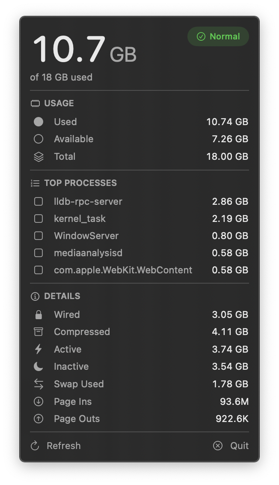

# MemBar

A lightweight macOS menu bar app that displays real-time memory usage, memory pressure, and top memory-consuming processes.


<p align="center">
  
</p>

## Features

- **Real-time memory usage** - See used RAM in the menu bar at a glance (e.g. `13.4 GB`)
- **Memory pressure indicator** - Popover badge shows current pressure level (Normal, Warning, Critical)
- **Top 5 memory consumers** - See which processes are using the most RAM
- **Detailed memory breakdown**:
  - Used / Available / Total RAM
  - Wired, Compressed, Active, Inactive memory
  - Swap usage
  - Page ins / Page outs
- **Smart polling** - Refreshes every 5 seconds on power, 15 seconds on battery
- **Auto-start on login** - Registers automatically on first launch
- **Native macOS design** - Built with SwiftUI, follows Apple HIG

## Download

| Version | macOS | Download |
|---------|-------|----------|
| Latest | 15.0+ | [**Download DMG**](https://github.com/FetzerJack/MemBar/releases/latest) |

See all versions on the [Releases](https://github.com/FetzerJack/MemBar/releases) page.

## Installation

1. Download `MemBar.dmg` from [Releases](https://github.com/FetzerJack/MemBar/releases)
2. Open the DMG and drag MemBar to Applications
3. Launch MemBar from Applications
4. If prompted about unidentified developer, right-click > Open

MemBar will automatically start on login after the first launch.

## Building from Source

### Requirements
- macOS 15.0+
- Xcode 26+

### Build
```bash
git clone https://github.com/FetzerJack/MemBar.git
cd MemBar
xcodebuild -scheme MemBar -configuration Release build
```

## How It Works

MemBar reads memory data directly from macOS using Mach kernel APIs:
- **host_statistics64** - VM statistics (wired, active, inactive, compressed, free pages)
- **vm.swapusage** - Swap space usage via sysctl
- **top / ps** - Top memory-consuming processes with accurate memory values

Memory Used is calculated to match Activity Monitor: `App Memory + Wired + Compressed`, where App Memory = `internal_page_count - purgeable_count`.

The app polls every 5 seconds on AC power and every 15 seconds on battery to minimize energy impact.

## Privacy

MemBar runs entirely locally, collects no data, and requires no network access.

## License

MIT License - see [LICENSE](LICENSE) for details.

---

Made with 🧠 by [Jack Fetzer](https://github.com/FetzerJack)
